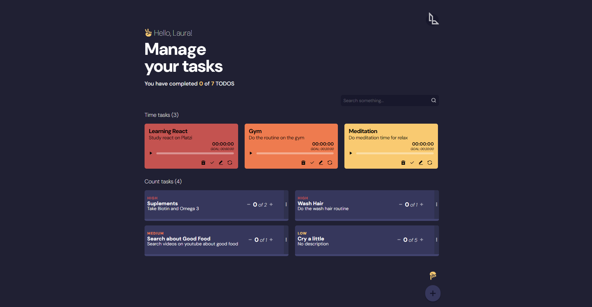

<h1 align="center">
     L-TODOs Machine with React
  <br>
</h1>

<h4 align="center">A TODOs project built with React</h4>

<p align="center">


<p align="center">Badges from <a href="https://shields.io/badges" target="_blank">Shields.io</a></p>

<p align="center">
  <a href="#key-features">Key Features</a> •
  <a href="#how-to-use">How To Use</a> •
  <a href="#credits">Credits</a> 
</p>

<p align="center"></p>

## Key Features

- Machine learning unsupervised clustering
  - Thanks to k-means algorithm we can cluster the colors and select the most representatives
  - This could have been done with an histogram, but where is the fun on that?
- Pyscript proxy with javascript events
  - Pyscript allows the communication between js and python by proxies and specific attributes.

## How To Use

To clone and run this application, you'll need [Git](https://git-scm.com). From your command line:

```bash
# Clone this repository
$ git clone https://github.com/lauramunozcaiced/ltodos.git

$ cd ltodos

$ npm start

```

Once the app is on you can go to `http://localhost:3000` and play around.

<br>

## Credits

This project was made following the Reac Course in Platzi:

- [Curso de React.js](https://platzi.com/cursos/react/)

---

Built with <span role="img" aria-label="heart emoji">💖</span> By Laura Muñoz Caicedo

> GitHub [@lauramunozcaiced](https://github.com/lauramunozcaiced)

